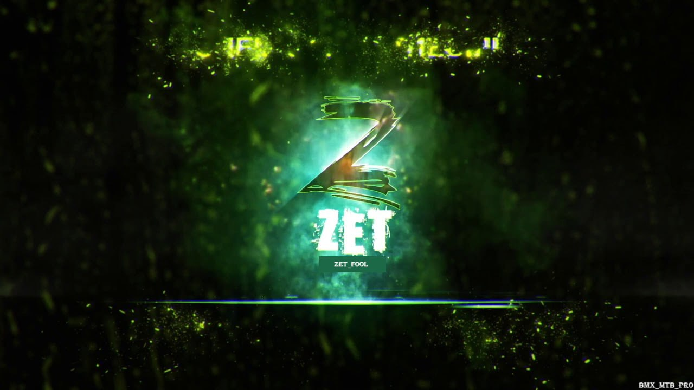

<div align="center">
  
  <h1>Zet: Your Conversational DevOps Agent</h1>
  <p><strong>Stop memorizing commands. Start having conversations with your terminal.</strong></p>
  <p>
    <a href="#"></a>
    <a href="#"></a>
    <a href="#"></a>
  </p>
</div>

---

## 🤔 Why Zet?

In a world of complex CLIs and endless flags, Zet offers a revolutionary alternative: a direct conversation with a `root`-powered agent in a secure, isolated environment. It's not just about running one command; it's about accomplishing tasks.

| Feature                 | Description                                                                                             |
| ----------------------- | ------------------------------------------------------------------------------------------------------- |
| 💬 **Natural Language** | Just tell Zet what you want to do. "Download python, unzip it, and add it to the path." Done.            |
| 🛡️ **Safe by Default** | Every command runs in a sandboxed `ubuntu:24.04` container. Your host OS is always safe.                |
| 🧠 **Transparent AI**   | Zet shows you its `thought` process, explaining *why* it chose a particular command before it runs.       |
|  empowered **Root on Demand**      | The agent has `root` access inside its sandbox, allowing it to install packages and manage services. |

## 🚀 How It Works

Zet operates in a simple, powerful loop:

1.  **You:** Provide a task in plain English.
2.  **Zet (AI):** Analyzes your request, forms a plan, and translates it into a precise shell command.
3.  **Zet (Executor):** Runs the command inside the secure Docker sandbox.
4.  **You:** See the output and continue the conversation.

## ⚡️ Getting Started

> **Prerequisites:** You'll need [Node.js](https://nodejs.org/) (v18+), [Docker](https://www.docker.com/), and the [Kiala API](https://github.com/derxanax/Kiala-api-qwen) running locally.

### 1. Setup Environment

Clone the repo, install dependencies, and run the one-time setup script to build the sandbox.

```bash
# Clone the project
git clone https://github.com/derxanax/ZeroEnhanced.git
cd ZeroEnhanced

# Install Node.js modules
npm install

# Build the Docker sandbox (one-time command)
npm run setup
```

### 2. Run Zet

Launch the agent and start giving it tasks.

```bash
npm run dev
```

> **Note:** A `/sandbox` directory is automatically created and shared with the Docker container, allowing for easy file exchange.

## 🛣️ What's Next?

Zet is an evolving platform. Here's where we're headed:

- [ ] **Multi-Step Execution:** Autonomous execution of complex, multi-command workflows.
- [ ] **Web & File Operations:** Native tools for interacting with APIs and the filesystem.
- [ ] **Persistent State:** Giving the sandbox memory and state that persists between sessions.
- [ ] **A GUI:** A dedicated graphical interface for managing Zet agents and their environments.

---
<p align="center">Made with ❤️ by derx and ZAEAZAEX.</p>

## Автор

👤 **Саша (zarazaex)**  
Telegram: [@zarazaex](https://t.me/zarazaex)

👤 **Derx / lyzt** 
Telegram: [@amyluutz](https://t.me/amyluutz)

Mail: derx@derx.space