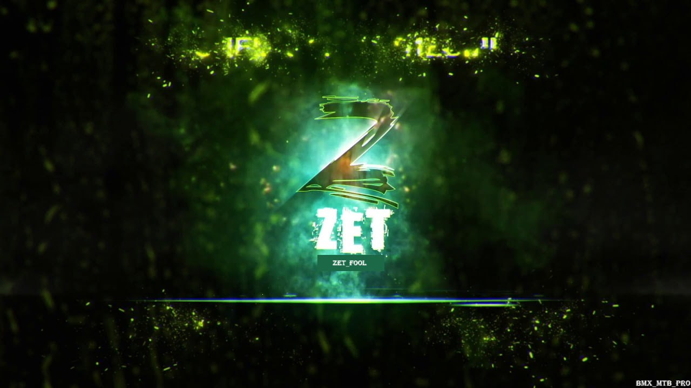

проект времено заморожен, информация будет позже, ожидайте новый ии тулз от одноименого разрабочика derxanax <div align="center">

  
  

  <h1>ZetGui: Ваш ИИ-агент</h1>
  <p><strong>Забудьте про запоминание команд. Начните разговор с вашим терминалом.</strong></p>
  <p> 
    <a href="#"></a>
    <a href="#"></a> 
    <a href="#"></a>
    <a href="#"></a>
    <a href="#"></a>
  </p>
</div>

## 🤔 Зачем ZetGui?

В мире сложных CLI и бесконечных флагов, ZetGui предлагает революционную альтернативу: прямой разговор с ИИ-агентом, работающим в безопасной изолированной среде. Это не просто выполнение одной команды — это решение задач через диалог.

| Возможность | Описание |
|-------------|----------|
| 💬 **Естественный язык** | Просто скажите ZetGui, что хотите сделать. "Скачай Python, распакуй и добавь в PATH." Готово. |
| 🛡️ **Безопасность по умолчанию** | Каждая команда выполняется в изолированном контейнере `ubuntu:24.04`. Ваша система всегда в безопасности. |
| 🧠 **Прозрачный ИИ** | ZetGui показывает свой процесс мышления, объясняя *почему* он выбрал определенную команду перед выполнением. |
| 🔧 **Полноценная IDE** | Встроенный редактор кода, файловый менеджер и терминал в одном приложении. |
| 📱 **Desktop + Web** | Работает как настольное приложение (Neutralino) и в браузере. |

## 🚀 Как это работает

ZetGui работает в простом, но мощном цикле:

1. **Вы:** Даете задачу на обычном языке
2. **ZetGui (ИИ):** Анализирует запрос, составляет план и переводит его в точную команду shell
3. **ZetGui (Исполнитель):** Выполняет команду внутри безопасного Docker-контейнера
4. **Вы:** Видите результат и продолжаете диалог

## ⚡️ Быстрый старт

> **Требования:** [Node.js](https://nodejs.org/) (v18+), [Docker](https://www.docker.com/), и [Kiala API](https://github.com/suusypullyhi/Kiala-api-qwen) запущенный на сервере (Project closed - zet mody source)

### 🎯 Быстрый запуск (одна команда!)

```bash
# Клонируем проект
git clone https://github.com/derxanax/ZeroEnhanced.git
cd ZeroEnhanced

# Запускаем главный скрипт управления
./script/Zet-Install.sh    # Linux/Mac
# или
# .\script\Zet-Install.ps1  # Windows PowerShell
```

**Главный скрипт предоставляет интерактивное меню:**
- 📦 **Установить системные зависимости** (Node.js, Docker, TypeScript)
- 🐳 **Настроить Docker окружение** (автоматическая сборка образа)
- 🔧 **Полная установка проекта** (все зависимости + Docker)
- ✅ **Проверить все зависимости** (детальная диагностика)
- 🖥️ **Запустить CLI версию** (с авто-проверкой)
- 🖥️ **Запустить Desktop GUI** (с авто-сборкой)
- 🌐 **Запустить Web версию** (с авто-настройкой)
- 🔨 **Собрать все компоненты** (включая Docker)
- 📊 **Детальная диагностика** (система, Docker, проект)
- 🧹 **Очистить временные файлы** (включая Docker cleanup)

### 🛠️ Ручная установка (опционально)

Если предпочитаете ручную установку:

```bash
# Установка зависимостей
./script/install-all-Dependencies.sh

# Сборка компонентов
./script/build-all.sh

# Запуск конкретной версии
./script/start-all-cli.sh     # CLI
./script/start-all-gui.sh     # Desktop GUI  
./script/start-all-web.sh     # Web версия
```

### ⚡ Умная автоматизация

**Все скрипты теперь полностью автоматизированы:**

🔧 **Автоматическая установка системных зависимостей:**
- Определение пакетного менеджера (dnf/apt/pacman/winget/chocolatey)
- Проверка версий Node.js (требуется 18+)
- Автоматическая установка Docker и настройка
- Добавление пользователя в группу docker

🐳 **Умная работа с Docker:**
- Автоматическая сборка образа `zet-sandbox-image:latest`
- Создание и запуск контейнеров
- Проверка состояния Docker daemon
- Интеллектуальный cleanup

🚀 **Интеллектуальные скрипты запуска:**
- Проверка всех зависимостей перед запуском
- Автоматическая компиляция TypeScript
- Установка npm модулей при необходимости
- Обработка конфликтов портов
- Graceful cleanup при завершении

🔍 **Подробная диагностика:**
- Статус системных зависимостей
- Проверка Docker окружения
- Анализ структуры проекта
- Мониторинг использования ресурсов

> **Примечание:** Папка `/sandbox` автоматически создается и монтируется в Docker контейнер для обмена файлами.

## 🏗️ Архитектура

```
ZeroEnhanced/
├── asset/             # Ресурсы (логотипы, изображения)
├── backend/           # Express.js API сервер
├── desktop/           # Neutralino desktop приложение
│   └── react-src/     # React UI компоненты
├── docker-sandbox/    # Docker окружение для выполнения команд
├── script/            # Полностью автоматизированные скрипты
│   ├── Zet-Install.*          # Главное интерактивное меню
│   ├── install-system-packages.*  # Установка системных пакетов
│   ├── setup-docker.*         # Настройка Docker окружения
│   ├── check-dependencies.*   # Helper функции проверок
│   ├── install-all-Dependencies.*  # Полная установка проекта
│   ├── build-all.*           # Сборка всех компонентов
│   └── start-all-*.*         # Умные скрипты запуска (CLI/GUI/Web)
├── src/              # Основная логика (CLI версия)
└── translate/         # Переводы README на разные языки
```

## 🧠 Интеллектуальное редактирование кода

ZetGui использует революционную систему **атомарных операций** для редактирования кода:

### 🔧 Точечные изменения вместо переписывания
Вместо перезаписи всего файла, ИИ выполняет хирургически точные операции:

```python
# Исходный код:
# 1: import random
# 2: print("привет")

# Пользователь: "Добавь import jsonify между импортами"
# ИИ выполняет атомарную операцию:
# - Сдвигает строку 2 → 3 (print("привет") перемещается вниз)  
# - Записывает import jsonify в освободившуюся строку 2

# Результат:
# 1: import random
# 2: import jsonify  ← новая строка
# 3: print("привет") ← сдвинутая строка
```

### ⚛️ Принцип атомарности
- **Одна операция за запрос**: ИИ может либо сдвинуть строку, либо добавить код, но не одновременно
- **Контролируемые изменения**: Каждое изменение видимо и отслеживается
- **Никаких потерь**: Код никогда не теряется при редактировании

## 🛣️ Что дальше?

ZetGui - развивающаяся платформа. Планы на будущее:

- [x] **Desktop приложение** с Neutralino
- [x] **Многоязычный интерфейс** 
- [x] **Атомарное редактирование:** Точечные изменения кода без переписывания
- [x] **Полная автоматизация установки и развертывания** ✨ *Новое!*
- [x] **Умные скрипты с автопроверкой зависимостей** ✨ *Новое!*
- [x] **Кроссплатформенная установка системных пакетов** ✨ *Новое!*
- [x] **Интерактивное меню управления проектом** ✨ *Новое!*
- [ ] **Автономное программирование:** ИИ работает в цикле до команды `endcycle`, создавая полные программы за один запрос
- [ ] **Многошаговое выполнение:** Автономное выполнение сложных многокомандных процессов
- [x] **Веб и файловые операции:** Встроенные инструменты для работы с API и файловой системой
- [ ] **Постоянное состояние:** Память sandbox между сессиями
- [ ] **Плагины:** Расширяемая система плагинов
- [ ] **Облачная синхронизация:** Синхронизация настроек и проектов

### 🎉 Недавно реализовано:
- **Умная автоматизация:** Все скрипты теперь самостоятельно проверяют и устанавливают зависимости
- **Системная установка:** Автоматическое определение ОС и пакетного менеджера
- **Docker Integration:** Полная автоматизация сборки и настройки Docker окружения
- **Детальная диагностика:** Комплексная проверка системы, Docker и проекта
- **Интерактивное меню:** Удобный интерфейс управления всеми функциями проекта

## 📝 Примеры использования

### Разработка
```
Пользователь: "Создай новый React проект с TypeScript"
ZetGui: Создаю React проект с TypeScript поддержкой...
$ npx create-react-app my-app --template typescript
```

### Интеллектуальное редактирование кода
```
Пользователь: "Добавь import json между существующими импортами"
ZetGui: Вставляю import json на строку 2, сдвигая остальные вниз...
✓ Inserted line 2: import json
✓ Existing code shifted down automatically

Пользователь: "Замени print на logging в строке 5"  
ZetGui: Заменяю строку 5 на logging вызов...
✓ Replaced line 5: logging.info("message")
```

### DevOps
```
Пользователь: "Проверь статус всех Docker контейнеров и перезапусти остановленные"
ZetGui: Проверяю Docker контейнеры и перезапускаю остановленные...
$ docker ps -a && docker start $(docker ps -aq --filter "status=exited")
```

### Системное администрирование
```
Пользователь: "Найди все файлы больше 100MB и покажи топ-10"
ZetGui: Ищу большие файлы в системе...
$ find / -type f -size +100M -exec du -h {} + 2>/dev/null | sort -rh | head -10
```

## 👥 Авторы

👤 **Саша (zarazaex)**  
Telegram: [@zarazaex](https://t.me/zarazaex)

👤 **Derx / lyzt**  
Telegram: [@amyluutz](https://t.me/amyluutz)  
Mail: derx@derx.space

👤 **Алексей**

---

<div align="center">
  <p>Made with ❤️ by derx and zarazaex</p>
  
  <p>
    <a href="https://github.com/derxanax/ZeroEnhanced">⭐ Star on GitHub</a> |
    <a href="https://github.com/derxanax/ZeroEnhanced/issues">🐛 Report Bug</a> |
    <a href="https://github.com/derxanax/ZeroEnhanced/discussions">💬 Discussions</a>
  </p>
</div>
