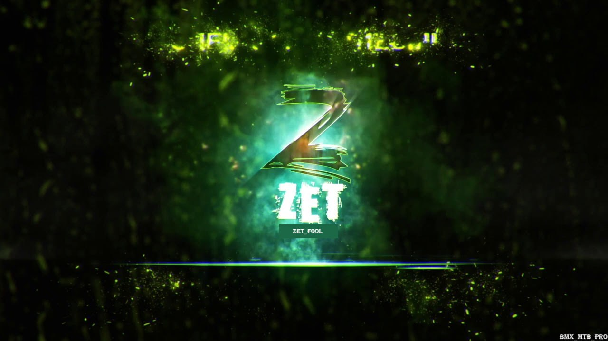

<div align="center">
  
  
  <!-- Language Selection -->
  <p>
    <a href="../README.md">🇷🇺 Русский</a> | 
    <strong>🇺🇸 English</strong> | 
    <a href="README_CN.md">🇨🇳 中文</a> | 
    <a href="README_DE.md">🇩🇪 Deutsch</a>
  </p>
  
  <h1>ZetGui: Your AI Terminal & IDE</h1>
  <p><strong>Stop memorizing commands. Start having conversations with your terminal.</strong></p>
  <p>
    <a href="#"></a>
    <a href="#"></a>
    <a href="#"></a>
    <a href="#"></a>
    <a href="#"></a>
  </p>
</div>

## 🤔 Why ZetGui?

In a world of complex CLIs and endless flags, ZetGui offers a revolutionary alternative: a direct conversation with an AI agent running in a secure, isolated environment. It's not just about running one command; it's about accomplishing tasks through dialogue.

| Feature | Description |
|---------|-------------|
| 💬 **Natural Language** | Just tell ZetGui what you want to do. "Download Python, unzip it, and add it to PATH." Done. |
| 🛡️ **Safe by Default** | Every command runs in a sandboxed `ubuntu:24.04` container. Your host OS is always safe. |
| 🧠 **Transparent AI** | ZetGui shows you its thought process, explaining *why* it chose a particular command before running it. |
| 🔧 **Full IDE** | Built-in code editor, file manager, and terminal in one application. |
| 📱 **Desktop + Web** | Works as desktop app (Neutralino) and in browser. |

## 🚀 How It Works

ZetGui operates in a simple, powerful loop:

1. **You:** Provide a task in plain language
2. **ZetGui (AI):** Analyzes your request, forms a plan, and translates it into a precise shell command
3. **ZetGui (Executor):** Runs the command inside the secure Docker sandbox
4. **You:** See the output and continue the conversation

## ⚡️ Quick Start

> **Prerequisites:** [Node.js](https://nodejs.org/) (v18+), [Docker](https://www.docker.com/), and [Kiala API](https://github.com/derxanax/Kiala-api-qwen) running locally.

### 1. Setup Environment

```bash
# Clone the project
git clone https://github.com/derxanax/ZeroEnhanced.git
cd ZeroEnhanced

# Install dependencies
npm install

# Build Docker sandbox (one-time)
npm run setup
```

### 2. Run Backend

```bash
cd backend
npm install
npm run dev  # Runs on localhost:3003
```

### 3. Run Desktop App

```bash
cd desktop
npm install
npm run dev  # Launches Neutralino app
```

### 4. Or Run Web Version

```bash
cd desktop/react-src
npm install
npm start   # Runs on localhost:3000
```

> **Note:** A `/sandbox` directory is automatically created and shared with the Docker container for file exchange.

## 🏗️ Architecture

```
ZeroEnhanced/
├── backend/           # Express.js API server
├── desktop/           # Neutralino desktop application
│   └── react-src/     # React UI components
├── docker-sandbox/    # Docker environment for command execution
└── src/              # Core logic (CLI version)
```

## 🛣️ What's Next?

ZetGui is an evolving platform. Here's where we're headed:

- [x] **Desktop Application** with Neutralino
- [x] **Multilingual Interface**
- [ ] **Multi-Step Execution:** Autonomous execution of complex, multi-command workflows
- [x] **Web & File Operations:** Native tools for interacting with APIs and the filesystem
- [ ] **Persistent State:** Sandbox memory between sessions
- [ ] **Plugin System:** Extensible plugin architecture
- [ ] **Cloud Sync:** Settings and projects synchronization

## 📝 Usage Examples

### Development
```
User: "Create a new React project with TypeScript"
ZetGui: Creating React project with TypeScript support...
$ npx create-react-app my-app --template typescript
```

### DevOps
```
User: "Check status of all Docker containers and restart the stopped ones"
ZetGui: Checking Docker containers and restarting stopped ones...
$ docker ps -a && docker start $(docker ps -aq --filter "status=exited")
```

### System Administration
```
User: "Find all files larger than 100MB and show top 10"
ZetGui: Searching for large files in the system...
$ find / -type f -size +100M -exec du -h {} + 2>/dev/null | sort -rh | head -10
```

## 👥 Authors

👤 **Sasha (zarazaex)**  
Telegram: [@zarazaex](https://t.me/zarazaex)

👤 **Derx / lyzt**  
Telegram: [@amyluutz](https://t.me/amyluutz)  
Mail: derx@derx.space

👤 **Alexey**

---

<div align="center">
  <p>Made with ❤️ by derx and zarazaex</p>
  
  <p>
    <a href="https://github.com/derxanax/ZeroEnhanced">⭐ Star on GitHub</a> |
    <a href="https://github.com/derxanax/ZeroEnhanced/issues">🐛 Report Bug</a> |
    <a href="https://github.com/derxanax/ZeroEnhanced/discussions">💬 Discussions</a>
  </p>
</div> 